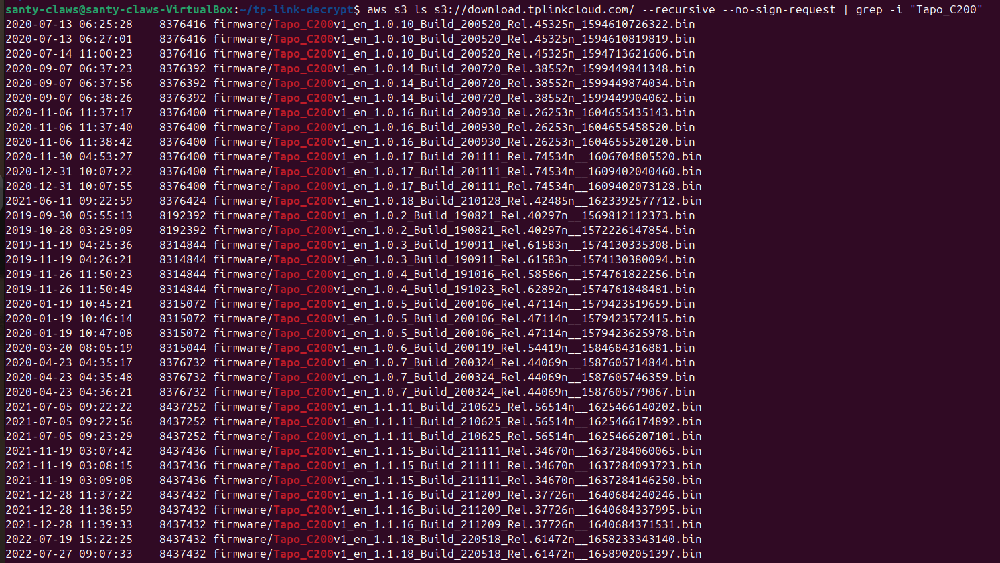
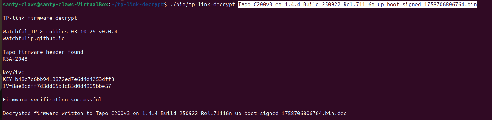
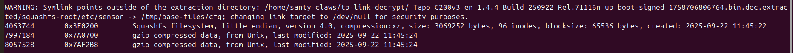

# Taking Apart a TP-Link Tapo C200 Camera: What I Found

| Field | Details |
| ------- | --------- |
| **Environment** | Ubuntu 24.04.4 LTS (Noble Numbat) |
| **Target** | TP-Link Tapo C200v3_en_1.4.4 Firmware |

---

## 1. What This Is About

I spent time tearing apart the TP-Link Tapo C200 camera's firmware to see what's inside. I couldn't physically access the device, so instead, I focused on getting the firmware, pulling out the encryption keys, and analyzing the files.

Here's what I discovered: the firmware is encrypted, but the decryption keys are publicly available in older code releases and previous firmware versions. Even worse, the firmware is stored on an open AWS S3 bucket with no password protection, meaning anyone can download every version ever released. I managed to crack open the camera through four main steps, but I ran into a big challenge: making sense of the stripped-down assembly code inside the device requires serious effort. This is where AI tools start becoming really useful for reverse engineering work.

---

## 2. How I Got Started

### 2a. Getting the Firmware

**The Goal:** Download the firmware from TP-Link without needing to own the camera.

I started by doing some basic research (OSINT) and watching how the Android app talks to TP-Link's servers. Turns out, the firmware lives on Amazon's S3 cloud storage, and it's completely open to anyone. No password needed. I found that out courtesy of [this site](https://www.evilsocket.net/2025/12/18/TP-Link-Tapo-C200-Hardcoded-Keys-Buffer-Overflows-and-Privacy-in-the-Era-of-AI-Assisted-Reverse-Engineering/)

**Setting up AWS CLI:**

```bash
sudo snap install aws-cli --classic
```

**Finding the target firmware:**

```bash
aws s3 ls s3://download.tplinkcloud.com/ --recursive --no-sign-request | grep -i "Tapo_C200"
```

Here's what I saw:



**Downloading it:**

I picked the version `Tapo_C200v3_en_1.4.4_Build_250922_Rel.71116n_up_boot-signed_1758706806764.bin` and grabbed it:

```bash
wget http://download.tplinkcloud.com/firmware/Tapo_C200v3_en_1.4.4_Build_250922_Rel.71116n_up_boot-signed_1758706806764.bin
```

---

### 2b. Breaking Through the Layers

The work came down to four main steps, each removing one security layer to get to the next.

---

#### Step 1: Decryption (Using `tp-link-decrypt`)

The firmware is encrypted, which is the first wall. But here's the thing — the decryption keys are sitting in publicly available old GPL code.

**The Approach:** I used the `tp-link-decrypt` tool to remove the DES-CBC encryption and turn the scrambled file into something readable.

**Step 1 — Get the Tool:**

```bash
sudo apt install git
git clone https://github.com/robbins/tp-link-decrypt.git
cd tp-link-decrypt
```

Check the README and install what you need (binwalk, build-essential, etc.):

```bash
./preinstall.sh
```

**Step 2 — Pull the Keys:**

The tool doesn't come with the keys for copyright reasons, but there's a script that grabs them from public old code:

```bash
./extract_keys.sh
```

**Step 3 — Decrypt the Firmware:**

```bash
make
./bin/tp-link-decrypt Tapo_C200v3_en_1.4.4_Build_250922_Rel.71116n_up_boot-signed_1758706806764.bin
```

The tool checks the RSA-2048 signature and decrypts the file:



---

#### Step 2: Extracting the Files (`binwalk`)

Now that the encryption is gone, I can see what's inside the firmware.

**The Approach:** I used `binwalk -e` to find and pull out all the compressed data.

**What I Found:** A Squashfs filesystem — basically the directory structure that runs on the camera, with all the system folders like `/bin`, `/etc`, and `/lib`.

**What This Means:** I now have access to the actual files the camera uses.

> **Note:** From here on, I used Gemini 3 Pro to help me understand what I was looking at and decide what to do next.

Gemini suggested running `binwalk` to dig into the decrypted file:

```bash
binwalk -e Tapo_C200v3_en_1.4.4_Build_250922_Rel.71116n_up_boot-signed_1758706806764.bin.dec
```

This created a folder called `_Tapo_C200v3_en_1.4.4_Build_250922_Rel.71116n_up_boot-signed_1758706806764.bin.dec.extracted` with a `squashfs-root` subfolder containing the entire Linux system from the camera:



---

#### Step 3: Finding Interesting Stuff (`firmwalker`)

Thousands of files were now visible. I needed a faster way to hunt for secrets.

**The Approach:** I ran `firmwalker`, a tool designed to automatically scan for high-value keywords like "password," "admin," "token," and "SSL."

**The Key Find:** Basically all the important security logic lives in one giant 3.5 MB file named `main` in the `/bin` folder.

**What This Means:** The `bin/main` file is the "brain" of the camera — this is where to focus next.

I also used a few other straightforward tools for digging through the files:

| Tool | What It Does |
| ------ | --------- |
| `strings` | Pulls out any readable text from the binary file |
| `grep` | Searches for specific keywords (passwords, keys, etc.) |
| `find` | Locates SSL certificates and config files |

---

#### Step 4: Decompiling the Code (`ghidra`)

This is where things get tough. I opened `bin/main` in Ghidra, a professional reverse-engineering tool.

**The Challenge:** The binary has no symbols or function names — it's just raw assembly code.

**What I Did:** Ghidra converted the assembly into C-like pseudocode so I could actually read it. I used Gemini 3 Flash to help decode the confusing parts, like figuring out which variables held passwords and which functions did the cryptographic hashing.

---

### 2c. The Hard Truth

I successfully broke open the camera, but it revealed something important: the outer walls (encryption and compression) are easy to crack with standard tools, but understanding the inside — the actual business logic in `main` — is brutally hard.

**The Real Bottleneck:** Even with decompiled code, thousands of lines of nameless pseudocode are nearly impossible to make sense of without AI. This gap is growing, and AI is filling it.

---

## 3. What I Actually Found

### Issue 1: Hardcoded Encryption Keys

The firmware uses DES and RSA keys to encrypt everything, but here's the problem — those keys are hardcoded in the camera's code and sitting in public old GPL releases.

- **Why It Matters:** The encryption doesn't actually protect anything since anyone can grab the keys from public sources.

---

### Issue 2: Firmware is Stored with Zero Security

All firmware versions ever released are on Amazon's S3 storage, completely open to the public — no authentication needed.

- **Why It Matters:** Even if new vulnerabilities are fixed in firmware updates, anyone can download old versions to find those vulnerabilities. They could also compare old and new versions to see exactly what was changed.

---

## 4. References

1. Evilsocket. (2025, December 18). *TP-Link Tapo C200 Hardcoded Keys, Buffer Overflows and Privacy in the Era of AI Assisted Reverse Engineering.* <https://www.evilsocket.net/2025/12/18/TP-Link-Tapo-C200-Hardcoded-Keys-Buffer-Overflows-and-Privacy-in-the-Era-of-AI-Assisted-Reverse-Engineering/>

2. Kaiser, Q. (2025, July 25). *Rooting the TP-Link Tapo C200.* Quentin Kaiser – Security Research. <https://quentinkaiser.be/security/2025/07/25/rooting-tapo-c200/>

3. WatchfulIP & Robbins. *TP-Link Decrypt Tool Repository.* <https://github.com/robbins/tp-link-decrypt>
