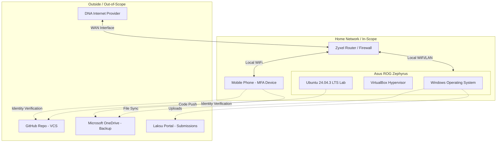

# ISMS Scope and Management: Home Lab Environment

## 1. Baseline: ISMS Scope

### 1.1 What is Included (In-Scope)

This ISMS scope encompasses the specific technical environment, data, and access methods required to successfully complete, secure, and submit academic cyber-security exercises.

#### Hardware (The Physical Layer)

- **Asus ROG Zephyrus Windows Laptop**: The primary host machine where all local computation, documentation, and virtualization occur.
- **Zyxel Router**: The central network gateway. It manages local IP assignments (DHCP) and provides the first line of defense via its internal firewall.
- **Mobile Phone**: A critical security asset used exclusively for Multi-Factor Authentication (MFA) via SMS or authenticator apps to protect cloud identities.

#### Virtual Environments (The Lab Layer)

- **Oracle VirtualBox**: The Type-2 hypervisor used to isolate the lab environment from the host operating system.
- **Ubuntu 24.04.3 LTS VM**: The dedicated, "disposable" workspace where all technical course exercises are performed.

#### Information Assets (The Data Layer)

- **Course Intellectual Property**: Technical reports, source code, and configuration files.
- **Access Credentials**: SSH keys, GitHub credentials, and login credentials for the Laksu portal.
- **Lab Datasets**: Any data downloaded or generated during exercises.

### 1.2 What is Excluded and Why

#### ISP Infrastructure (DNA)

The external fiber/copper lines and the provider's core network.

**Justification**: No administrative control. Risk is accepted as "Service Availability Risk."

#### Physical Home Security

The locks, windows, and structural integrity of the residence.

**Justification**: While physical theft is a risk to the laptop, the ISMS focuses on digital information security management within the controlled network.

#### Non-Course Personal Data

Personal photos, financial records, or unrelated software on the Asus laptop.

**Justification**: To maintain a lean, auditable scope, only assets relevant to the "Student" role are managed here. This ensures clarity during peer reviews.

### 1.3 Key Interfaces

#### External Cloud Services

- **GitHub**: Primary version control and code integrity platform.
- **Microsoft OneDrive**: Off-site backup for documents and VM snapshots.
- **Laksu Portal**: The official interface for academic submission and peer review.

#### Network Boundary

The Zyxel router serves as the logical boundary between the "Untrusted" Internet (DNA) and the "Trusted" Lab LAN.

#### Identity Interface

The bridge between cloud service providers and the mobile phone during MFA challenges.

---

## 2. Network and Interface Diagram

---

## 3. Interested Parties and Requirements

| Interested Party | Need / Expectation / Requirement | ISO 27001 Area | How to Demonstrate (Evidence) |
| ----------------- | ---------------------------------- | ---------------- | ------------------------------ |
| **Student (Owner)** | Continuity of the lab environment; ensuring no data loss before the final exam. | Operation (8.1) | Screenshot of VirtualBox VM list and OneDrive "Sync Complete" status. |
| **Course Teachers** | Assurance that submissions are the student's own work and submitted on time. | Performance Evaluation (9.1) | GitHub commit logs showing incremental work history (not a single bulk upload). |
| **Peer Reviewers** | Accessibility of the submitted reports and clarity of documentation. | Support (7.4 - Communication) | Verified links to GitHub repositories or Laksu portal confirmation emails. |
| **Cloud Providers** | Account security to prevent the lab machine from being used in botnets/spam. | Context (4.2) | Screenshot of GitHub/Microsoft Security dashboard showing "MFA Enabled." |
| **ISP (DNA)** | Compliance with the "fair use" policy (no malicious scanning from the home IP). | Planning (6.1 - Risks) | Router logs showing no abnormal outgoing traffic or blocked intrusion attempts. |

---

## 4. Evidence Add-on: "What could I present?"

- **Network Authorization**: A screenshot of the Zyxel router's "Connected Devices" page, showing only the Asus laptop and Phone, proving no unauthorized access.

- **System Integrity**: A screenshot of the Ubuntu VM's "About" page or terminal showing the version 24.04.3 LTS and the host VirtualBox manager.

- **Version Control**: A screenshot of the GitHub repository history showing a timeline of commits, which serves as evidence of the development process.

- **Backup Verification**: A screenshot of the OneDrive web interface showing the folder `Application_Hacking` with the "Last Modified" timestamp within the last 24 hours.

- **Access Control**: A screenshot of the "Security" tab in GitHub/Microsoft account settings where the MFA (Multi-Factor Authentication) status is explicitly visible.

---

## Sources

- [SFS-EN ISO/IEC 27001:2023](https://hhmoodle.haaga-helia.fi/pluginfile.php/4610078/mod_folder/content/0/ISO27001-2023-fi.pdf?forcedownload=1). Information security, cybersecurity and privacy protection. Information security management systems. Requirements. Helsinki: Finnish Standards Association SFS. [Accessed via Haaga-Helia University of Applied Sciences Moodle / SFS Online]

- [Karvinen, T. 2024. Application Hacking](https://terokarvinen.com/application-hacking/). (Accessed 17 Jan 2026).
