# h2 Break & Unbreak

## Reading Summaries

### OWASP Top 10: A01 Broken Access Control

- This vulnerabilty maintained its #1 spot on the OWASP top 10. 100% of apps tested were found to have some form of broken access control

- As the name implies it is basically the failure of access control polices (polices that determine the scope of user permissions). This usually leads to unauthorized information disclosure, modification, or destruction of data.

- Common examples are:
  - Violation of the principle of least privilege (deny by default)
  - Bypassing access control checks by modifying the URL
  - An accessible API with missing access controls for POST, PUT, and DELETE.
  - Elevation of privilege i.e. acting as a user without being signed in or gaining privileges beyond that of a logged in user
  - CORS misconfiguration which allows API access from unauthorized or untrusted origins etc.

- Prevention techinques include but are not limited to:
  - Deny by default (least privilege) except for public resources
  - Implement access control mechanisms once, and reuse them throughout the application
  - Implementing rate limits on API and controller access to minimize harm from automated attack tooling
  - Logging access control failures and alerting admins when appropriate.

### Finding Hidden Web Directories - Fuzz URLs with ffuf

- One way to try to find the hidden directories of a web server is by trying different paths manually. Ffuf is a tool I can use to automate the process
- Ffuf is used for more than just finding hidden directories, it is a full feature fuzzing tool
- To install ffuf on Linux (Debian) with the package manager using the command `sudo apt-get update` followed by `sudo apt-get install ffuf`.
- We need to have a dictionary with a list of possible directories, one per line. We could do this manually but such dictionaries already exist online so we can download an use them.
- Running ffuf is pretty simple and fast. To see all the parameters run `ffuf`.
- Using a wordlist you could run something like `ffuf -w <wordlist_path> -u <website_url>/FUZZ`. There are also options to filter the responses.

### Access Control Vulnerabilities and Privilege Escalation - PortSwigger

- Access control is the application of constraints on who or what is authorized to perform actions or access resources.

- To decide what you are allowed to do, a system uses authentication to verify your identity and session management to track your ongoing activity

- Access control verifies permissions through this lenses: vertical (is your rank high enough?), horizontal (is this your data?), and context-dependent (is the situation right?).

- Examples of vertical privilege escalation include
  - Unprotected functionality i.e. where the application doesn't provide protection for sensitive functionality like admin dashboard
  - Broken access control resulting from platform misconfiguration etc.

- Usually a horizontal privilege escalation attack can be turned into a vertical privilege escalation e.g. getting the credentials to an admin account

- A subcategory of access control vulnerabilities are Insecure Direct Object References (IDORs). This occurs if an application uses user-supplied input to access objects directly and an attacker can modify the input to get unauthorized access

- Some ways to prevent this is by:
  - Never relying on only obfuscation for access control
  - Deny by default (least privilege)
  - Using a single application-wide mechanism for access control, wherever possible
  - At code level, making sure developers declare the access that is allowed for each resource.
  - Thoroughly auditing and testing access controls to be sure they work.

### Report Writing

This page summarises best practices to follow when writing a report on tests done on a computer.

- The mark of a good test report is its repeatablity; a classmate should be able to duplicate your methods and achieve identical results.
- A good report must also be precise. Telling excatly what was done, how it was done, how long it took, and what happened after it was done.
- A good report must also be easy to read. This can be achieved by using clear simple language, and neat formatting, using subheadings.
- Finally, a good report refers to the sources. This is a good practice and it shows that the author of the report is familiar with the area.

Common mistakes made when writing a report include:

- Fabrication i.e making stuff up, claiming to do what you didn't do
- Plagiarism - copying text without indicating the source, or presenting results of others as your own (basically fraud)
- Unauthorized copying of images from the web (this infringes on copyrights)

## a) 010-staff-only

- **Working Environment**: Ubuntu 24.04.3 LTS running on Oracle Virtual Box (fully virtualized testing environment)
- **Browser**: Moxilla Firefox

No special precautions were required, as all tools and tests were executed in a controlled local environment.

All required dependencies were installed according to the task instructions. Since the operating system was Ubuntu rather than Debian, all package installations were performed using `sudo apt` instead of `sudo apt-get`.

Based on the challenge description, it was clear that the application was vulnerable to an SQL injection attack. The application requested a PIN value and used it directly in a database query.

To confirm this, an SQL injection payload was entered into the PIN input field. However, the attempt failed because the input field only accepted numeric values.

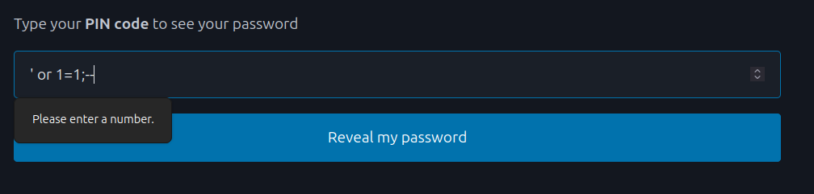

Inspection of the HTML form using the browser's developer tools (opened with `F12`) showed that the PIN field was restricted using the `type="number"` attribute. This restriction was enforced only on the client side.

The `type` attribute was removed manually in the browser, allowing text input

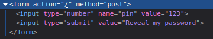


After removing the input restriction, the following SQL injection payload (`' OR 1=1;--`) was entered. This transformed the original query to:

```sql
  SELECT password FROM pins WHERE pin='' OR 1=1;--'
```

Since `1=1` always evaluates to true, this query returns all rows from the table. However, the application was designed to display only a single result, so only one password was shown


Although the returned password was not the administrator password, this confirmed that the application was vulnerable to SQL injection.

The challenge instructions indicated that the administrator password contained the string "SUPERADMIN". Based on this information, the payload was modified to filter results `' OR password LIKE '%SUPERADMIN%';--` making the full query:

```sql
  SELECT password FROM pins WHERE pin='' OR password LIKE '%SUPERADMIN%';--'
```

After disabling the input field restriction again and submitting the payload, the correct administrator password was returned.
The exploit was therefore successful.


The `LIKE` operator filters results, ensuring that only the password containing `"SUPERADMIN"` is returned. Since the application displays one matching result, the administrator password was revealed.

## b) Fixing 010-staff-only

To have a look at the source code I used `micro`. I ran the command `micro staff-only.py`
Looking at the source code, it was quite clear where the vulnerability was coming from:

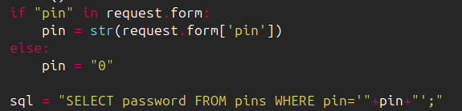

This block of code shows that the user provided input is directly used in the SQL query without any validation or sanitization, all it check is if the field is empty.

By following best practices, using a parameterized SQL query:

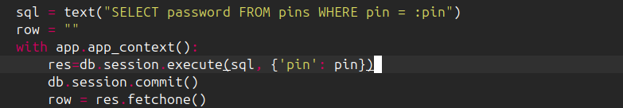

Using this method ensures that all user inputs are properly "espcaped" i.e. treated as plain text and not executable code.

Now when I try running the previous exploits, they no longer work


## c) Solving dirfuzt-1

- **Working Environment**: Ubuntu 24.04.3 LTS running on Oracle Virtual Box (fully virtualized testing environment)
- **Browser**: Moxilla Firefox

When making requests with ffuf, I disconnected my VM from the internet.

All required dependencies were installed according to the task instructions. Since the operating system was Ubuntu rather than Debian, all package installations were performed using `sudo apt` instead of `sudo apt-get`.

To begin I downloaded the challenge using `wget` as in:

```bash
wget https://terokarvinen.com/2023/fuzz-urls-find-hidden-directories/dirfuzt-1
```

I then used `chmod` to add the execute permission to the file:

```bash
chmod u+x dirfuzt-1
```

Then I was able to run it with `./dirfuzt-1`

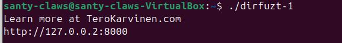
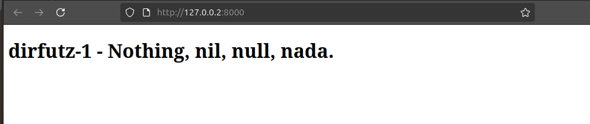

Next, in a separate terminal window, I used `wget` to download the Seclists dictionary:

```bash
wget https://terokarvinen.com/2023/fuzz-urls-find-hidden-directories/Miessler-etal-2023-SecLists/common.txt
```

With `common.txt` downloaded, I disconnected from the internet and used `ffuf` to automate the requests with the wordlist like so:

```bash
ffuf -w common.txt -u http://127.0.0.2:8000/FUZZ
```

This command takes the wordlist given with the `-w` parameter and tests each line from the list one by one against the target URL set with the `-u` parameter.
This works but it returns way too much information for me to filter through manually.


To see more about the parameters that I can use with `ffuf`, I used the command `man ffuf` to view the manual pages.

Based on the initial scan, it was clear that nearly all requests returned identical responses: an HTTP 200 status code, a response size of 154 bytes, 9 words, and 10 lines. Since the most consistent point of variation across responses was the content size, filtering was applied using the `-fs` parameter to exclude these uniform results.

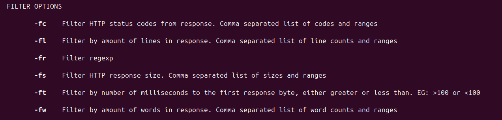

So I ran the command

```bash
ffuf -w common.txt -u http://127.0.0.2:8000/FUZZ -fs 154
```

This gives a smaller set of results, and some look interesting


`wp-admin` looks interesting to me so I try it manually in the url bar, as in `http://127.0.0.2:8000/wp-admin`, and that seems to be the right url


## d) Breaking into 020-your-eyes-only

- **Working Environment**: Ubuntu 24.04.3 LTS running on Oracle Virtual Box (fully virtualized testing environment)
- **Browser**: Moxilla Firefox

When making requests with ffuf, I disconnected my VM from the internet.

All required dependencies were installed according to the task instructions. Since the operating system was Ubuntu rather than Debian, all package installations were performed using `sudo apt` instead of `sudo apt-get`.

After installing all dependencies and making and deploying all migrations in Django, I had the app up and running


Now since this app is written in Django, SQL injection isn't a viable option to pursue in my opinion.

I decided to create an account first and then work my way up.

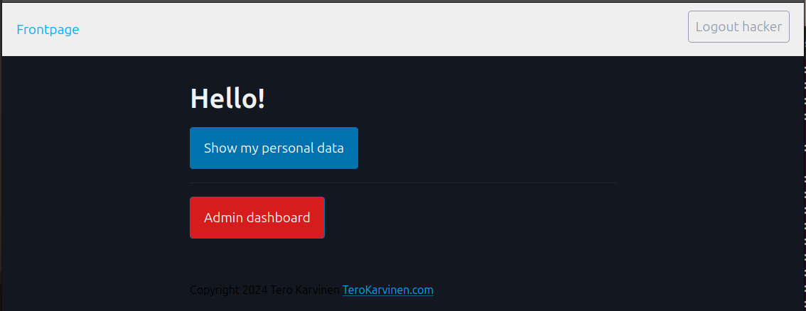

When I click on the admin dashboard button I am not allowed through


I decide to use `ffuf` to try to find hidden directories, now that I am signed in.
In a separate terminal window, I use the same wordlist from the [dirfutz-1](#c-solving-dirfuzt-1) exercise.

I disconnected from the internet and ran the command:

```bash
ffuf -w common.txt -u http://127.0.0.1:8000/FUZZ
```

Now this takes more time than the previous exercise, but one response stands out, both from ffuf and the logs of the django app, `admin-console`


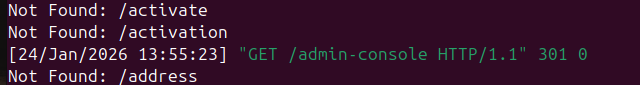

Trying this URL as in `http://127.0.0.1:8000/admin-console` proves to be the right address

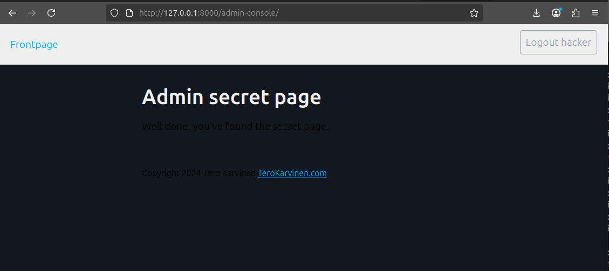

## d) Fixing 020-your-eyes-only

From the nature of this vulnerability, it is clear that the app is only checking if I am user when I follow the `/admin-console` route, but checking if I am a user and with admin right when I use the `/admin-dashboard` route.

Looking at the `urls.py` file in the `hats` app, I can see that both routes are there


One option will be simply getting rid of the `admin-console` route, but then I admin users will lose access to the `AdminShowAllView`.

I decide to go into the `views.py` file to see how the `AdminShowAllView` view is set up.

This reveals the problem as clear as day:

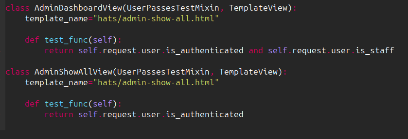

In the `AdminDashboardView` the app checks if the user is authenticated and the user is a staff, but in the `AdminShowAllView` it just checks that the user is authenticated.

This explains why the dashboard route prevents access but the console route doesn't.

To fix this I simply add the check to ensure that the user is a staff.

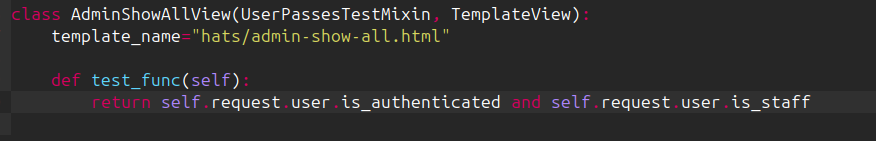

Now when I try to access the `admin-console` route again, I am blocked, showing that this vulnerability has been resolved.


## Sources

- Karvinen, T. *Application Hacking – Break & Unbreak*.  
  <https://terokarvinen.com/application-hacking/#h2-break--unbreak-tero>

- Karvinen, T. (2023). *Fuzz URLs – Find Hidden Directories*.  
  <https://terokarvinen.com/2023/fuzz-urls-find-hidden-directories/>

- Karvinen, T. *Hack n Fix*.  
  <https://terokarvinen.com/hack-n-fix/>

- W3Schools. *SQL LIKE Operator*.  
  <https://www.w3schools.com/sql/sql_like.asp>

- StackHawk. *Finding and Fixing SQL Injection Vulnerabilities in Flask (Python)*.  
  <https://www.stackhawk.com/blog/finding-and-fixing-sql-injection-vulnerabilities-in-flask-python/>
