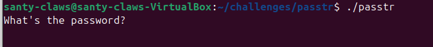
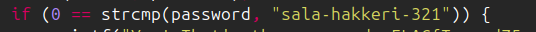

# h3 No Strings Attached

**Working Environment**: Ubuntu 24.04.3 LTS  
**Installed Dependencies**:

- `wget 1.21.4`
- `micro 2.0.13`
- `unzip 6.0`
- `upx-ucl 4.2.2`

---

## a) Strings

### Initial Setup

I downloaded and extracted the exercise files using the following commands:

```bash
wget https://terokarvinen.com/loota/yctjx7/ezbin-challenges.zip 
unzip ezbin-challenges.zip
rm ezbin-challenges.zip  # Remove the zip file after extraction
cd challenges/passtr
```

### Finding the Password

I first attempted to run the binary:

```bash
./passtr
```

The program prompted me for a password:



I tried entering a random string, but it was rejected:


To find the password, I used the `strings` command to extract human-readable text from the binary (I found a good tutorial on strings [on this page](https://labex.io/tutorials/linux-linux-strings-command-with-practical-examples-422934)):

```bash
strings passtr
```

The output revealed several interesting strings, most notably:


The password `sala-hakkeri-321` was clearly visible in the output. I verified this by running the program again with the discovered password, which successfully authenticated:


---

## b) Fixing passtr.c

### Problem Analysis

I opened the source code file to understand why the password was visible:

```bash
micro passtr.c
```

The issue was immediately apparent: the password was hardcoded as a string literal directly in the source code:



When a string literal like `"sala-hakkeri-321"` is used in C code, the compiler stores it in the binary's read-only data section, making it easily discoverable with the `strings` command.

> [!NOTE]
> After each modification to the source code, I recompiled the binary using the `make` command: `make passtr`

### First Attempt: Variable Declaration

My initial approach was to define the password as a standalone variable. However, this still resulted in the password appearing in the binary:


This failed because the compiler still stores the string literal in the binary's data section, regardless of whether it's assigned to a variable.

### Second Attempt: Character-by-Character Construction

After researching online, I found a [Stack Overflow post](https://stackoverflow.com/questions/1356896/how-to-hide-a-string-in-binary-code) suggesting that building the string character by character could prevent it from appearing in the binary.

I implemented this approach:


This successfully hid the password from the `strings` command output:


However, this broke the program's functionality:


### Final Solution: Adding Null Terminator

After investigating the issue, I discovered that C strings must be null-terminated (ending with `\0`) for string comparison functions like `strcmp()` to work correctly. Without a null terminator, `strcmp()` continues reading into undefined memory regions, causing unpredictable behavior.

I added the null terminator to the end of the character array, which resolved the issue:


The program now functions correctly while keeping the password hidden from `strings`:


**Key Takeaway**: By constructing the password character by character at runtime rather than using a string literal, the password no longer appears in the compiled binary's data section, effectively hiding it from basic analysis tools like `strings`.

---

## c) Packd

I navigated to the packd challenge directory:

```bash
cd challenges/packd
```

### Initial Analysis

I began by running `strings packd` to check if the password was stored in plain text like in the previous challenge. However, the output was unusually short and contained no useful information.

### Identifying the Packer

While examining the `strings` output more carefully, I noticed a distinctive signature: **UPX**. This indicated that the binary had been compressed using UPX (Ultimate Packer for eXecutables), a common tool used to reduce binary size and obfuscate code.


### Unpacking the Binary

To analyze a UPX-packed binary, I needed to reverse the packing process. Here's how I did it:

**1. Install UPX:**

```bash
sudo apt-get install upx-ucl
```

**2. Unpack the binary:**

I used the `-d` (decompress) flag to restore the binary to its original, unpacked state:

```bash
upx -d packd
```


**3. Extract the password:**

After successfully unpacking the file, I ran `strings packd` again. This time, the full content of the binary was accessible, and the password was clearly visible in the output.


### Results

- **Password:** `piilos-AnAnAs`
- **Flag:** `FLAG{Tero-0e3bed0a89d8851da933c64fefad4ff2}`

I verified the solution by running the program with the discovered password, which successfully authenticated and revealed the flag.


**Key Takeaway**: Binary packing tools like UPX can hide strings and obfuscate code to prevent easy analysis. However, most packers can be reversed using the same tool that created them, making it a relatively simple protection to bypass for reverse engineers.

---

## Sources

Karvinen, T. 2025. *Application Hacking*. Available at: <https://terokarvinen.com/application-hacking/> (Accessed: 29 January 2026)

LabEx. 2024. *Linux strings Command with Practical Examples*. Available at: <https://labex.io/tutorials/linux-linux-strings-command-with-practical-examples-422934> (Accessed: 29 January 2026)

Stack Overflow. 2009. *How to hide a string in binary code?* Available at: <https://stackoverflow.com/questions/1356896/how-to-hide-a-string-in-binary-code> (Accessed: 29 January 2026)
