# h4 Some Disassembly Required

## x) Video Summary

### Hammond 2022: Ghidra for Reverse Engineering

- Role in Static Analysis: Ghidra is utilized as the primary tool for static analysis when standard command-line utilities (like strings or objdump) are insufficient, particularly for "stripped" binaries that lack debugging symbols.

- Project Setup & Import: The workflow begins by creating a new non-shared project and importing the target executable. Ghidra then runs automated analyzers to reconstruct the binary's logic and structure.

- Navigation via Strings: A key technique for locating relevant code is opening the "Defined Strings" window to find known text (e.g., prompts) and using the "Cross-Reference" (XREF) feature to jump directly to the code where that string is used.

- Decompilation Capability: Ghidra’s Decompiler window converts raw assembly instructions into high-level, C-like pseudocode, making it easier to understand complex control flow and conditional logic (such as if/else checks).

- Code Refactoring: The tool allows users to manually rename variables and functions (e.g., renaming a generic function to unscramble_flag) to verify hypotheses and progressively de-obfuscate the code.

> [!NOTE]
> For all lab tasks:
> **Working Environment**: Ubuntu 24.04.3 LTS  
> **Installed Dependencies**:
>
> - `wget 1.21.4`
> - `ghidra`
> - `unzip 6.0`
> - `upx-ucl 4.2.2`
> - `snapd`

---

## a) Installing Ghidra

To install Ghidra, I used `snap`, the package manager. For Ubuntu versions from 16.04 LTS (Xenial Xerus) onwards, `snap` is available by default, but for other versions it can be installed by running the commands:

```bash
sudo apt update
sudo apt install snapd
```

Then to install `ghidra` I ran:

```bash
sudo snap install ghidra
```

After installing, to verify that the app works as intended, I ran the command:

```bash
ghidra
```

This starts the application, showing that the install was successful.


---

## b) Rever-C

### Downloading and Extracting the Challenge

I began by downloading the challenge file, extracting it, and cleaning up:

```bash
wget https://terokarvinen.com/loota/yctjx7/ezbin-challenges.zip
unzip ezbin-challenges.zip
rm ezbin-challenges.zip
cd challenges/packd
```

### Unpacking the Binary

Following the same process as the previous exercise, I unpacked the binary:

```bash
upx -d packd
```

### Analyzing with Ghidra

I created a new project in Ghidra and imported the unpacked file for analysis.

Once Ghidra finished analyzing the file, the listing view immediately highlighted the main function:


Clicking on it revealed the decompiled code in the decompiler window:

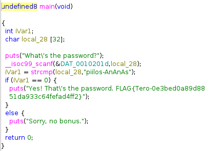

### Improving Readability

For better analysis, I renamed the variables to more descriptive names:

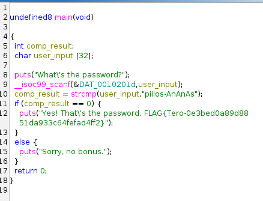

### Understanding the Program Logic

The program works as follows:

1. **Initialization**: Creates a variable `comp_result` to store the string comparison result, and a character array `user_input[32]` to store user input

2. **User Interaction**: Prints the prompt `What's the password?` and reads the user's input into `user_input`

3. **Password Comparison**: Uses `strcmp` to compare the input against the password `piiilos-AnAnAs`
   - Returns `0` if strings match
   - Returns a negative number if the second string is greater
   - Returns a positive number if the first string is greater

4. **Result Handling**:
   - If `comp_result == 0` (strings match): prints congratulatory message and flag
   - Otherwise: prints `Sorry, no bonus.`

5. **Exit**: Returns `0` to indicate successful execution

### Breaking the Program

To reverse the password check, I examined the assembly code. A helpful resource for understanding assembly conditionals can be found [on this page](https://www.tutorialspoint.com/assembly_programming/assembly_conditions.htm).

> [!NOTE]
> Clicking on decompiled code highlights the corresponding assembly line

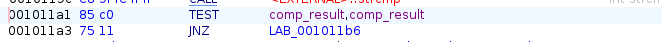

The assembly shows a `JNZ` (Jump Not Zero) instruction that checks if the `TEST` result is not equal to 0.

### Patching the Binary

To reverse the logic:

1. Right-click on the `JNZ` instruction
2. Select "Patch Instruction"
3. Change `JNZ` to `JZ` (Jump Zero)

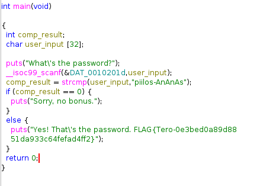

This effectively inverts the logic—the program now accepts all passwords *except* the correct one.

### Exporting and Testing the Patched Binary

To export the modified binary:

1. Click on `File` in the menu ribbon
2. Select `Export Program`
3. Set the program format to `Original File`
4. Choose the destination folder and click OK

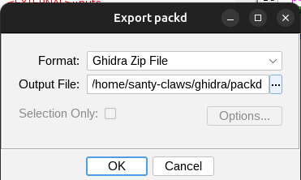

Then I added execution permissions to the file and tested it:

```bash
chmod 744 packd
./packd
```

After entering any incorrect password, the program accepts it:


But it rejects the correct password `piiilos-AnAnAs`:

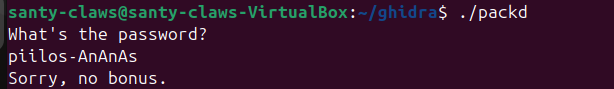

---

## c) If Backward

### Analysis with Ghidra

This exercise follows the same process as the previous one. I created a new project in Ghidra and imported the `passtr` binary for analysis.

Once Ghidra finished analyzing the file, I examined the main function in the decompiler window:


### Identifying the Conditional Jump

The assembly code shows the same `JNZ` (Jump Not Zero) conditional jump checking if the `strcmp` return value is not 0:

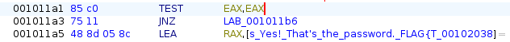

### Patching the Binaries

To reverse the logic:

1. Right-click on the `JNZ` instruction
2. Select "Patch Instruction"
3. Change `JNZ` to `JZ` (Jump Zero)

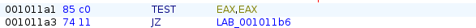


This inverts the logic so the program accepts any password except the correct one.

### Exporting and Testing the Patched Binaries

To export the modified binary:

1. Click on `File` in the menu ribbon
2. Select `Export Program`
3. Set the program format to `Original File`
4. Choose the destination folder and click OK

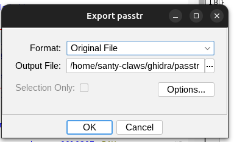

Then I added execution permissions to the file and tested it:

```bash
chmod 744 passtr
./passtr
```

After entering any incorrect password, the program accepts it:

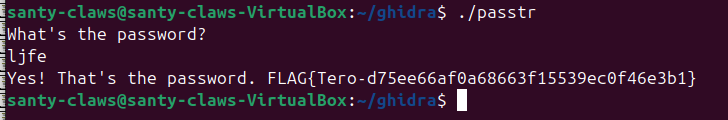

But it rejects the correct password:


---

## d) Solving Nora CrackMe01

To begin this task, I first started by downloading the zip file of the [github repo](https://github.com/NoraCodes/crackmes), unzipped it can compiled `crackme01.c` according to the instructions given in the README file, by running:

``` bash
   make crackme01
```

This created the binary executable `crackme01.64`.

To test the file, I run

``` bash
   ./crackme01.64
```

The program returns that the program needs exactly one argument

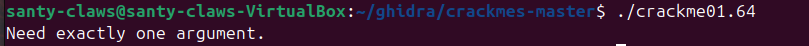

So I try running with a random string as the argument:

``` bash
   ./crackme01.64 random_string
```

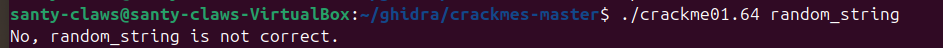

But it shows that it is not the correct password. But now I have a general understanding of how the program functions.

To see if there are any interesting strings in the binary I run:

``` bash
   strings crackme01.64
```

The output is mostly cryptic to me, but something stands out to me:


There is a string here `password1`, and I rerun the program giving that string as the argument

``` bash
   ./crackme01.64 password1
```


And that was the correct password 🎉

## e) Solving Nora CrackMe01e

Still in the same directory where I downloaded extracted the zip file from the previous exercise, I compiled `crackme01e.c`:

``` bash
   make crackme01e
```

This created the binary executable `crackme01e.64` and I ran it using:

``` bash
   ./crackme01e.64
```

And again it too need one argument

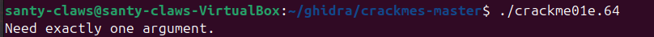

This time I just directly run `strings` on the binary to see what I can find there

``` bash
   strings crackme01e.64
```

And again this shows an interesting string


With this, it is safe to assume that the password this time is `slm!paas.k`. So I run:

``` bash
   ./crackme01e.64 slm!paas.k
```

But this returns something interesting


My guess to why this happened is because `!` is a special character, so I rerun the command, but this time escaping the character:

``` bash
   ./crackme01e.64 slm\!paas.k
```

And this gives the correct outcome 🎉


## f) Solving Nora CrackMe02

### Compiling and Initial Testing

First, I compiled `crackme02.c`:

```bash
make crackme02
```

This generated `crackme02.64`. I tested it by running:

```bash
./crackme02.64
```

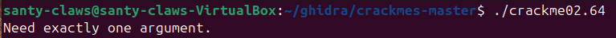

The program requires one argument. I tested it with a random input:

```bash
./crackme02.64 random_123
```

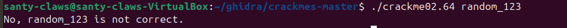

### Ghidra Analysis

I opened Ghidra and imported the file for analysis.

After Ghidra completed its analysis, I examined the main function in the decompiler window:

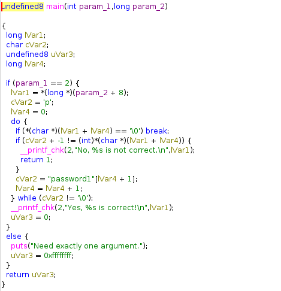

### Improving the Readability

For better analysis, I renamed the variables based on their functionality:

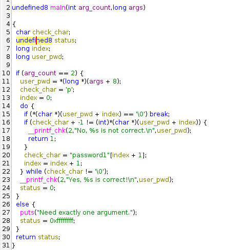

### Understanding the Program

The main function has two parameters:

- `arg_count`: the number of arguments passed
- `args`: an array of the actual arguments

The program defines four variables:

- `check_char`: for comparing the user input character by character
- `status`: for the exit code of the program
- `index`: for indexing strings during comparison
- `user_pwd`: to extract the user-inputted password from the arguments

#### Argument Count Check

The program checks if exactly two arguments were passed. This initially seemed confusing since the error message says "one argument," but I learned that in C, the program name itself (e.g., `./crackme02.64`) is always the first argument. So the check for `arg_count == 2` actually verifies that one password was provided.

If the argument count is incorrect, the program:

1. Prints the error message
2. Sets `status` to `0xffffffff`
3. Returns the status and exits

#### Password Extraction

If the correct number of arguments is passed, the program extracts the user input:

- It adds 8 to the argument pointer, skipping the first argument (the program name)
- It stores the user's password in `user_pwd`

#### Character-by-Character Comparison

The program initializes:

- `check_char` to `p`
- `index` to `0`

Then it enters a do-while loop for comparison:

1. **End-of-string check**: Verifies the current character isn't `\0` (null terminator). If it is, the loop ends.

2. **Character comparison**: This is the interesting part:
   - Takes `check_char`
   - Subtracts 1 from it
   - Checks if the character in `user_pwd` at the current index matches this altered value

3. **Loop continuation**:
   - If they match: increments `index` by 1, then updates `check_char` to the character in the string `password1` at the corresponding index
   - If they don't match: prints the error message, sets `status` to 0, returns it, and ends the program

### Finding the Solution

The program checks if the input matches `password1` but with all characters shifted down by 1 in ASCII value.

Using the [ASCII character chart](https://www.ascii-code.com/), I determined that `password1` with each character shifted down by 1 ASCII value becomes: ``o`rrvnqc0``

### Testing the Solution

I ran the program with the correct password:

```bash
./crackme02.64 o\`rrvnqc0
```

> [!NOTE]
> The backslash escapes the backtick `` ` `` character, which is a special character in the terminal


The program accepted the password, confirming the solution was correct 🎉.

## Sources

- Karvinen, T. 2025. *Application Hacking*. Available at: <https://terokarvinen.com/application-hacking/#h4-some-disassembly-required-tero>

- NoraCodes. *Crackmes - A collection of reverse engineering challenges*. GitHub repository. Available at: <https://github.com/NoraCodes/crackmes>

- ASCII Code. *The complete ASCII Table*. Available at: <https://www.ascii-code.com/>

- Tutorials Point. *Assembly - Conditions*. Available at: <https://www.tutorialspoint.com/assembly_programming/assembly_conditions.htm>
