# Dynamic Analysis

## Getting Started with LLDB

All tests in this report were run on Ubuntu 24.04.4 in VirtualBox.

>[!NOTE]
>
> I used Gemini 3 Pro and Claude Sonnet 4.6 to help find relevant commands and format this Markdown report.

First, I installed LLDB:

```bash
sudo apt install lldb
```

I already had most dependencies from the lecture environment. To install Rust from [rustup.rs](https://rustup.rs), I ran:

```bash
curl --proto '=https' --tlsv1.2 -sSf https://sh.rustup.rs | sh
```

I used the standard installation option.

Next, I cloned the repository used for the examples:

```bash
git clone https://github.com/hhgitmax/gdb-lecture.git
cd gdb-lecture
```

The repository contains two relevant subfolders: `check-pin` and `concat`. I built both programs:

```bash
cd check-pin
cargo b

cd ../concat
cargo b
```

Build output examples:


Before starting analysis, I confirmed that the `rust-lldb` wrapper was available:

```bash
rust-lldb --version
```

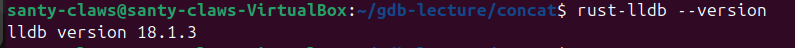

---

## 1. Watching a Value Change in a Loop

For this task, I used the `concat` program. Its faulty `concat` function builds a string by counting down from `n` to `0`.

I launched LLDB with the compiled binary:

```bash
cd concat
rust-lldb target/debug/concat
```

Inside LLDB, I set a breakpoint on `concat` and started execution:

```bash
(lldb) breakpoint set --name concat::concat
(lldb) run
```

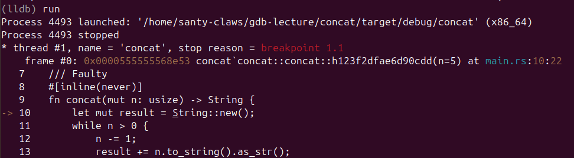

After hitting the breakpoint, I stepped into the loop with `next` and inspected locals:

```bash
(lldb) next
(lldb) frame variable
```

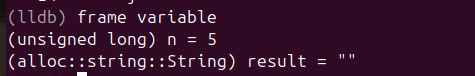

I then tried to watch `result` directly:

```bash
(lldb) watchpoint set variable result
```

This failed:

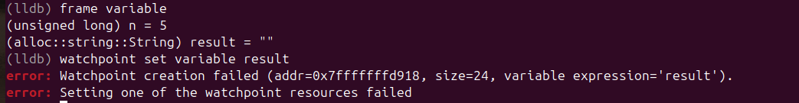

Reason: Rust `String` is internally a 24-byte struct (pointer, length, capacity), while hardware watchpoints in LLDB are limited to 1, 2, 4, or 8 bytes.

I also tried watching `len` directly:

```bash
(lldb) watchpoint set expression -- &result.len
```

This also failed because `len` is a method in Rust, not a directly addressable field:

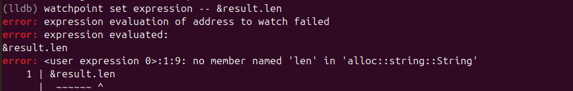

As a workaround, I set a breakpoint on line 13 (where `result` is modified) and attached a command to print `result` each time that breakpoint is hit:

```bash
(lldb) breakpoint set --file main.rs --line 13
(lldb) breakpoint command add 1
> frame variable result
> DONE
```

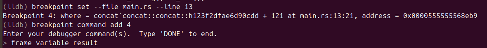

Then I continued execution:

```bash
(lldb) continue
```

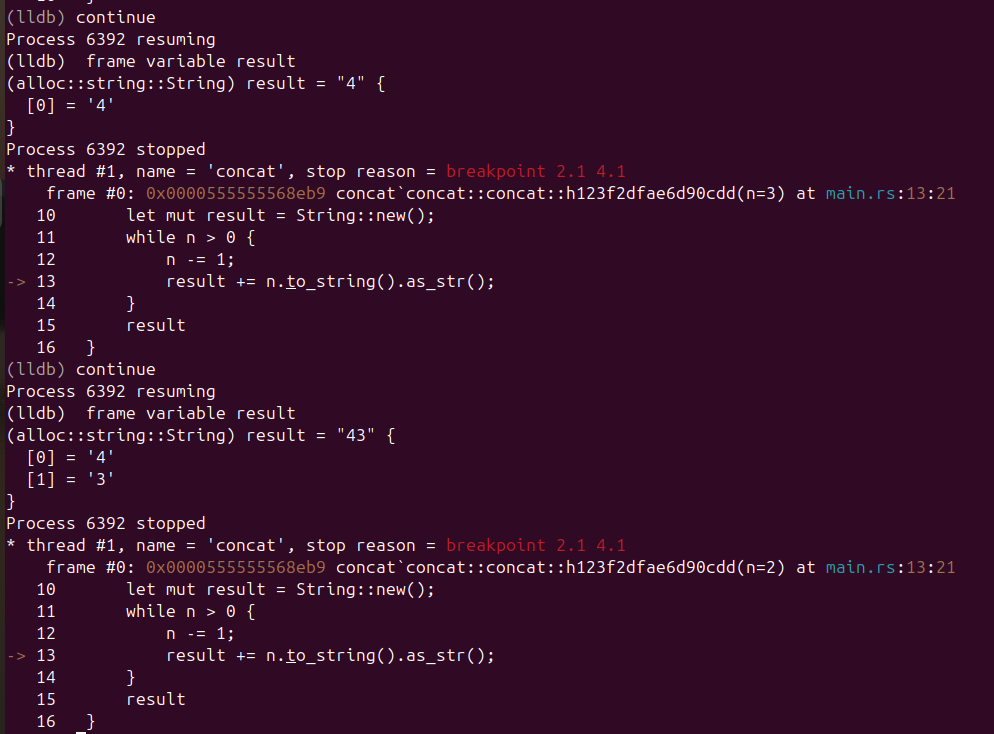

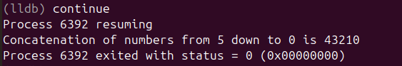

This approach took more steps than in GDB, where `watch result` can be more straightforward. In LLDB, a breakpoint with an attached print command is a practical workaround for composite Rust types.

---

## 2. Modifying a Return Value from False to True

For this task, I used `check-pin`, which compares user input against a hardcoded PIN and prints either "Access granted!" or "Access denied!".

I started LLDB:

```bash
cd ../check-pin
rust-lldb target/debug/check-pin
```

Then I set a breakpoint on `check_password`, ran the program, and entered an incorrect PIN:

```bash
(lldb) breakpoint set --name check_pin::check_password
(lldb) run
```

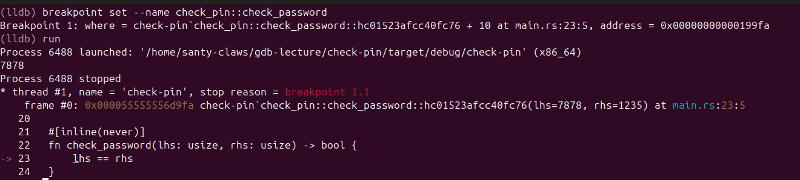

After the wrong input, execution paused at the breakpoint. I used `finish` to return from the function and inspected `rax`:

```bash
(lldb) finish
(lldb) register read rax
```

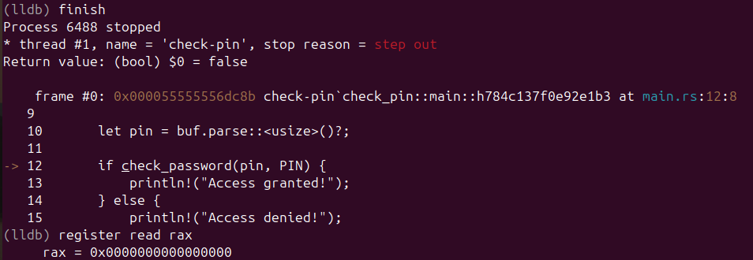

On x86_64 SysV ABI, function return values are placed in `rax`. I changed it to `1` (`true`) before resuming:

```bash
(lldb) register write rax 1
(lldb) register read rax
(lldb) continue
```

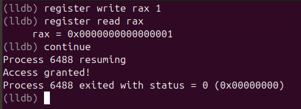

---

## 3. Modifying a Function Argument

This task can be done either by changing a local variable or by changing registers directly. I used register manipulation.

### Register Manipulation

I set a breakpoint on `check_password` and edited argument registers. On x86_64 SysV ABI, the first argument is passed in `rdi` and the second in `rsi`:

```bash
(lldb) breakpoint set --name check_pin::check_password
(lldb) run
```

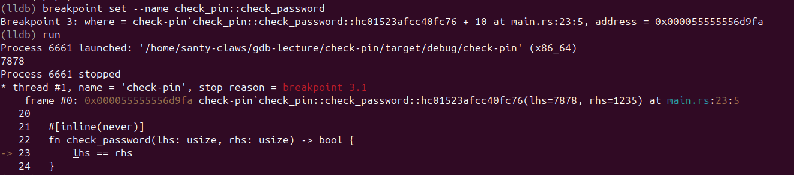

```bash
(lldb) register read rdi rsi
(lldb) register write rdi 1235
(lldb) register write rsi 1235
(lldb) register read rdi rsi
(lldb) continue
```

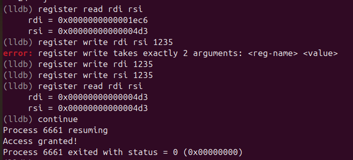

---

## 4. GDB vs LLDB: A Comparison

After repeating the in-class GDB examples with LLDB, these were the main differences I observed.

### Command Syntax

GDB favors short commands (`b`, `r`, `n`, `c`, `finish`, `info locals`, `set var`) while LLDB uses more explicit command forms (`breakpoint set --name`, `run`, `next`, `continue`, `finish`, `frame variable`, `expression`). LLDB reads more clearly, but is slower to type unless you use abbreviations.

| Task | GDB | LLDB |
| --- | --- | --- |
| Set breakpoint on function | `b function_name` | `breakpoint set --name function_name` |
| Print local variables | `info locals` | `frame variable` |
| Modify a variable | `set var pin = 1235` | `expression pin = 1235` |
| Read registers | `info registers` | `register read` |
| Write a register | `set $rax = 1` | `register write rax 1` |
| Watch a variable | `watch result` | `watchpoint set variable result` |
| Step over | `n` | `next` |
| Continue | `c` | `continue` |

### Rust Support

Both `rust-gdb` and `rust-lldb` are wrappers that load Rust pretty-printers. In my tests, `rust-lldb` displayed `String` and `usize` values cleanly. On ARM-based systems (for example Apple Silicon), LLDB is typically the native and more practical debugger.

### Stability and Platform Support

As discussed in the lecture, GDB support on ARM-based PCs is limited. LLDB, as part of LLVM (the same ecosystem used by `rustc`), tends to integrate smoothly with Rust binaries across platforms.

### Which Tool Would I Use, and When?

For day-to-day Rust development, I would use **`rust-lldb`** first because of toolchain alignment, cross-platform reliability, and readable output.

I would still keep **`rust-gdb`** as a fallback on Linux systems where GDB workflows or extensions are already established.

In short: **LLDB for regular cross-platform Rust debugging, GDB when Linux-specific tooling makes it preferable.**
