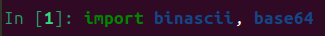
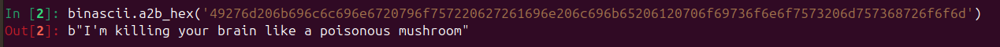
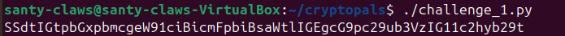
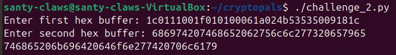
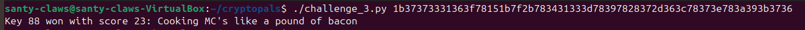
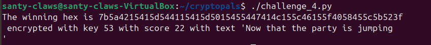

# h7 Uhagre2

## Reading Summary

### Schneier 2015: Applied Cryptography, 20th Edition — Chapter 1: Foundations

#### 1.1 Terminology

A readable message is called **plaintext**. Hiding it through mathematics is **encryption**, which produces a scrambled output called **ciphertext**. Reversing this is **decryption**.

Good security does more than hide data. It also proves who sent a message, ensures nothing was altered in transit, and prevents senders from denying they sent it.

The mathematical process used to scramble data is the **algorithm**. The secret value used alongside it is the **key**. Keeping the algorithm secret is a bad idea — safe systems use heavily tested, public algorithms and keep only the key private.

There are two main types of cryptographic systems:

- **Symmetric:** Both parties share the same key to lock and unlock messages.
- **Public-key:** A publicly visible key encrypts the message, while a separate private key is needed to decrypt it.

Attackers try to recover the key or read the message without permission. Common methods include studying ciphertext, comparing it to known plaintext, or forcing the system to encrypt chosen inputs to find patterns. Sometimes the simplest attack is just threatening or bribing someone for the key.

A system is considered secure when the time, money, and computing power needed to break it far exceed the value of the protected data.

#### 1.4 Simple XOR

XOR (exclusive-or) works on individual bits. If two bits match, the result is 0; if they differ, the result is 1. Crucially, applying XOR twice with the same value always returns the original data, which makes it reversible.

In a simple XOR cipher, plaintext is mixed with a repeating keyword using XOR to produce ciphertext. Running that ciphertext through the same keyword reverses it — encryption and decryption are the same operation.

Despite this elegance, simple XOR offers very little real security. An attacker can determine the keyword length by shifting the ciphertext against itself and spotting where repeating patterns align. Once the key length is known, natural language patterns (English letter distributions are highly predictable) make it possible to recover the message in seconds.

Many software vendors label XOR-based schemes as "proprietary" and market them as fast and secure. In practice, they serve only as a basic deterrent against casual snooping and won't stop a determined attacker.

#### 1.7 Large Numbers

Cryptography relies on astronomically large numbers to quantify security guarantees, and everyday intuition completely fails to picture them.

The chapter offers physical analogies to make these scales tangible. Smaller numbers correspond to rare but relatable events like a lottery win or a lightning strike. The largest numbers map to things like the total number of atoms in the observable universe or the time until all stars burn out. The takeaway: brute-forcing a strong cipher by trying every possible key would take longer than the age of the universe, making the attack practically impossible.

---

### Python Basics for Hackers

#### Fast Feedback Loop

Work in small, incremental steps to catch errors early and keep coding enjoyable. The main tools for this are the **REPL** (`python3` / `ipython3`), a dedicated `tries/` directory for experimenting with new libraries, and **F5 compile** in your editor to run code instantly.

#### Python REPL

The built-in Python REPL lets you type a command, press enter, and immediately see the result — making it a handy calculator and scratchpad. **iPython** extends this with history navigation (↑/↓ arrows, Ctrl-R reverse search), tab completion, inline reference docs (`symbol?`), and full source inspection (`symbol??`).

#### Converting and Calculating

Switch between characters and their ASCII values with `ord("T")` → `84` and `chr(84)` → `'T'`. Convert between number bases with `hex()`, `bin()`, and `oct()`. Modulus (`%`) handles wrap-around arithmetic common in encryption, for example `13 % 12` → `1`.

#### Strings and Printing

Python offers several ways to build output: comma-separated `print()`, concatenation with `+`, and f-strings (`f"Result: {2+2}"`). F-strings are the most flexible as they evaluate any expression inside `{}` and support number alignment formatting — handy when comparing bit patterns side by side.

#### Loops and List Comprehensions

Use `for x in [list]` to iterate without worrying about off-by-one errors. `enumerate()` gives you both the index and the value when you need both. List comprehensions offer a compact way to transform sequences, for example `[chr(ord(c)+2) for c in "string"]`, and `"".join([...])` collapses a list back into a string.

#### Practical Obfuscation Example

A Caesar-cipher-style string can be decoded by shifting each character's ASCII value by the right offset. The recommended approach is to test each step in iPython first (`ord()`, then `+2`, then `chr()`), then assemble the full solution once each piece is confirmed.

#### Assertions and Debugging

`assert` states an expectation and crashes the program immediately if it isn't met — useful for catching wrong types or values early. Print debugging with `print(type(x))` and `print(x)` is fast and effective for short programs. `breakpoint()` drops you into an interactive debugger at any point in the code; install `ipdb` for tab completion and a nicer interface.

#### Data Types

`str` supports full Unicode but makes no guarantees about byte size per character. `bytes` stores raw bytes only and rejects non-ASCII literals. Cryptography challenges almost always require `bytes` rather than `str`, so knowing how to convert between them with `.encode("utf8")` and `.decode("ascii")` is essential.

#### Bitwise Operations and XOR

XOR (`^`) is central to encryption because it is the only reversible boolean operation — applying it twice with the same value returns the original. Characters must be converted to integers with `ord()` before XOR can be applied. Aligned f-strings (`:>10`) help you print bit patterns side by side to visually verify results.

#### Sorting and Scoring

Store candidate results as `(score, value)` tuples and call `.sort(reverse=True)` to rank them. This pattern is useful in frequency analysis: score each decryption attempt by how well its letter distribution matches expected English (ETAOIN SHRDLU), then surface the best candidates automatically.

#### Useful Libraries

- `requests` — download web pages
- `binascii` — convert between binary data and hex text (`b2a_hex`)
- `base64` — encode binary into ASCII-safe text and decode it back

---

## Solving Cryptopals

To get started, install `ipython3` for quick testing and `micro` as a lightweight editor:

```bash
sudo apt install ipython3 micro
```

### 1. Convert Hex to Base64

The goal is to convert a hex string to its base64 representation. Two libraries handle this cleanly: `binascii` to convert hex to bytes, and `base64` to encode those bytes.

Starting up `ipython3` and importing both libraries:



First, convert the hex string to raw bytes using `a2b_hex`:

```python
binascii.a2b_hex('49276d206b696c6c696e6720796f757220627261696e206c696b65206120706f69736f6e6f7573206d757368726f6f6d')
```



Then pass the result into `b64encode`:

```python
base64.b64encode(b"I'm killing your brain like a poisonous mushroom")
```


This gives the expected output: `SSdtIGtpbGxpbmcgeW91ciBicmFpbiBsaWtlIGEgcG9pc29ub3VzIG11c2hyb29t`. Tying it all together into a script:

```python
import binascii, base64

bin_str = binascii.a2b_hex(hex_string)   # hex string to raw bytes
b64_str = base64.b64encode(bin_str)      # raw bytes to base64
print(b64_str.decode('ascii'))           # strip b'' prefix for clean output
```

The final `.decode('ascii')` is purely cosmetic — it removes the `b''` wrapper so the output prints cleanly.



### 2. Fixed XOR

The goal is to take two equal-length hex buffers and XOR them together byte by byte.

```python
from binascii import a2b_hex

bytes_1 = a2b_hex(hex1)
bytes_2 = a2b_hex(hex2)

result = bytearray()
for b1, b2 in zip(bytes_1, bytes_2):
    result.append(b1 ^ b2)    # XOR each pair of bytes

print(result.hex())            # format result back as hex
```

`zip()` pairs up the bytes from each buffer so they can be XOR'd together. The result is accumulated in a `bytearray` and formatted back to hex at the end.



### 3. Single-Byte XOR Cipher

A ciphertext has been XOR'd against a single unknown byte. Since a byte can only hold one of 256 values (0–255), the approach is to try all of them and score each result.

The scoring function is the key insight: English text has a predictable distribution of common letters. Each decrypted candidate gets a point for every character that appears in `"etaoin shrdlu"`, and the highest-scoring result is almost certainly the correct one.

```python
def score_text(decoded_string):
    common_chars = "etaoin shrdlu"
    points = 0
    for char in decoded_string.lower():
        if char in common_chars:
            points += 1
    return points
```

For each of the 256 possible keys, XOR the entire ciphertext against that byte and score the result. Track whichever key produces the best score.

```python
for i in range(256):
    result = bytearray(b ^ i for b in encrypted_bytes)
    current_text = result.decode(errors='ignore')  # skip undecodable bytes
    score = score_text(current_text)

    if score > highest_score:
        highest_score = score
        winning_text = current_text
        winning_key = i
```



### 4. Detect Single-Character XOR

This challenge gives a file of 60 hex strings, one of which has been encrypted with single-byte XOR. The task is to find which one.

The solution builds directly on Challenge 3. The `single_byte` function is refactored to return its score instead of printing, then run across every line in the file. Whichever line scores highest is the encrypted one.

```python
from challenge_3 import single_byte

with open("4.txt", "r") as f:
    for line in f.readlines():
        score, key, text = single_byte(line.strip())   # .strip() removes the newline
        if score > winning_score:
            winning_score = score
            winning_text = text
            winning_key = key
```



---

## Sources

- [h7 Uhagre2 — Course assignment page](https://terokarvinen.com/application-hacking/#h7-uhagre2-tero)
- [Python for Hackers — Tero Karvinen](https://terokarvinen.com/python-for-hackers/)
- [Python file.readlines() — w3schools](https://www.w3schools.com/python/ref_file_readlines.asp)
